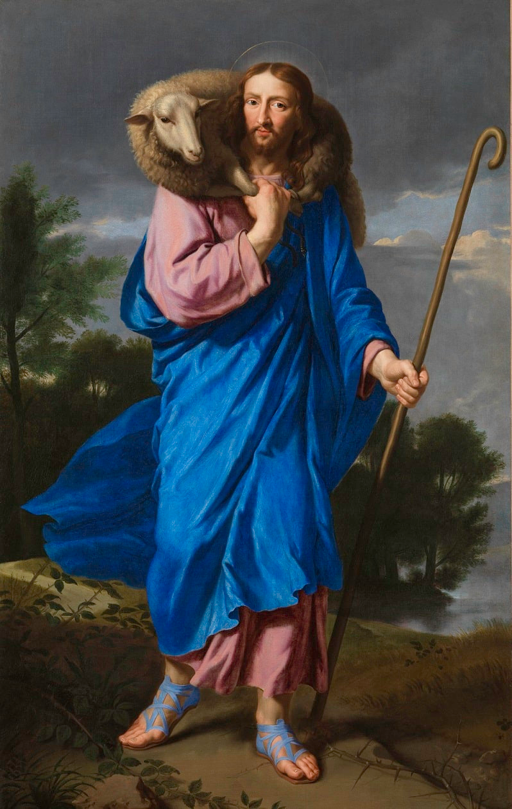

# MHRI · Magnifica Humanitas Redemptoris Iesu

**[Visit mhri.net](https://mhri.net/)**

An immersive, full-viewport presentation of *Le Bon Pasteur* (*The Good Shepherd*). The intention is to give the viewer the feeling of standing inside the painting: the figure remains the centre of attention, while landscape, atmosphere, light and a restrained movement of fabric create depth.

This repository contains the complete demonstration site, its artwork assets, and the GitHub Pages deployment workflow. It is a static React application; it needs no application server, database, account, or API key.



## The artwork and the attribution

The principal catalogue reference is the [Musée national de Port-Royal des Champs record for *Le Bon Pasteur*](https://port-royal-des-champs.fr/le-bon-pasteur/), inventory **1962.1.003**. It lists **Jean-Baptiste de Champaigne (1631–1681)**, oil on canvas, unsigned and undated, while discussing uncertainty between Jean-Baptiste and his uncle Philippe. A closely related version belongs to the Musée des Beaux-Arts de Tours, inventory **801.1.4**.

The museum connects the commission to Renaud de Sévigné and Port-Royal, suggesting 1662–1663; its account places the Paris community’s version by Easter 1664. It also proposes an older Flemish visual source in Bruegel’s Good Shepherd composition. These are catalogue findings and proposals, not a claim that every attribution or date is settled. [Museum record](https://port-royal-des-champs.fr/le-bon-pasteur/)

The reproduction in this repository is the **798 × 1260 pixel image supplied for the project**. Its exact photographic source has not been independently established. The catalogue reference documents the composition and attribution debate; it is not presented as proof of this file’s original download location. Closely related versions should not be identified solely from generic online captions.

## Research and iconography

### The recovered sheep and the Good Shepherd

The image combines themes that should be distinguished when interpreting it:

- **Luke 15:3–7:** the shepherd searches for the lost sheep, carries it home on his shoulders, and rejoices. The carried animal makes this passage especially relevant to the pose. [Luke 15](https://bible.usccb.org/bible/luke/15)
- **Matthew 18:12–14:** the search for the straying sheep expresses concern that none of the little ones should be lost. This places rescue within a wider theme of care for the vulnerable. [Matthew 18](https://bible.usccb.org/bible/matthew/18)
- **John 10:1–18:** the shepherd, gate, flock, thief and hired hand form a different, extended discourse. Christ’s willingness to give his life for the sheep connects protection with sacrifice. [John 10](https://bible.usccb.org/bible/john/10)

These passages inform the project’s reading of the painting. The site does not attempt a complete theological commentary, and the added motion is a present-day interpretation rather than historical evidence.

### The earlier sheepfold engraving

An engraving discussed during the project was **The Parable of the Good Shepherd**, **1565**, engraved by **Philips Galle after Pieter Bruegel the Elder**. The Metropolitan Museum of Art records an impression as **53.601.15(60)**, an engraving in its fourth state. [Met collection record](https://www.metmuseum.org/art/collection/search/383049)

In the supplied engraving, Christ stands in the doorway carrying a sheep while intruders attack the sheepfold around him. The inscription above the doorway, **EGO SVM OSTIVM OVIVM**, means “I am the door of the sheep.” This is the language of John 10:7: the doorway is part of the meaning, not merely a building in the background. The calm central figure and the disorder around the roof and walls create an opposition between care and predation. This paragraph is a visual reading of the supplied print, with the inscription translated here. [John 10](https://bible.usccb.org/bible/john/10)

The engraving provided an iconographic and lettering reference during design. It is not embedded in the live scene, and this project does not claim that a specific surviving impression was the painter’s direct source. The finished MHRI lettering is also not a tracing of the engraving’s inscription.

### Looking at the painting’s composition

The following observations describe the supplied reproduction and explain design decisions. They are the project’s visual interpretation, not quotations from a catalogue.

| Element | What it contributes to the composition | How the website treats it |
| --- | --- | --- |
| Face and sheep | The close placement of the two heads makes care visible as a physical relationship. The viewer’s attention returns to Christ’s face. | Facial features and the animal are kept still within the animated figure. |
| Blue mantle | The strongest cool colour occupies a large central area. Its folds establish weight and direction, while the projecting left edge suggests movement. | The original painted fabric is mapped onto a deformable mesh; only the loose region receives a small breeze. |
| Pink tunic and warm flesh | Warm notes interrupt the blue, especially at the face and hands. | Colour relationships come from the supplied reproduction; the figure is not repainted. |
| Shepherd’s crook | The long diagonal answers the upright figure and connects hand, sky and ground. | It has its own precise mask, so its narrow edges remain stable and the gap beside the robe stays open. |
| Halo | A very fine painted arc marks the head without dominating the sky. | The painted arc is retained, with a separate soft golden aureole behind the head. |
| Trees, water and distant sky | Overlapping forms and differences in scale lead the eye into the distance. | The scene expands sideways into an interpretive landscape with separate cloud, tree and foreground treatments. |
| Feet, path and brambles | The lower edge gives the figure a physical place to stand and introduces roughness into an otherwise calm presentation. The brambles invite a devotional reading of suffering along the path. | Persistent contact and cast shadows connect the feet to the extended ground. |

The blue is described as a visible colour, not as an identified historical pigment. No pigment analysis, conservation investigation, or new attribution research was undertaken for this demonstration.

## From a portrait painting to an immersive scene

The presentation is **2.5D**: painted surfaces move at different depths, and a local mesh deforms the fabric. It is not a recovered three-dimensional model of the historical scene.

The complete figure remains visible on both wide and narrow screens. Instead of cropping the portrait to fill a landscape screen, the background extends to the viewport edges. The original reproduction remains available through **About the painting → Show original painting**, allowing comparison with the unanimated portrait.

### Layers and depth

| Layer | Asset or implementation | Purpose |
| --- | --- | --- |
| Distant clouds | `public/art/cloud-sky.png` | A separate sky plate drifts very slowly behind the stationary tree silhouettes. |
| Middle-distance landscape | `public/art/landscape-wide.png` plus `landscape-foreground-mask.svg` | The extended landscape fills the viewport; its sky is masked so cloud motion does not move the trees. |
| Near landscape | The same landscape, revealed with a lower-edge mask | A small opposing parallax movement provides foreground depth. |
| Golden aureole | A circular CSS radial gradient | Sits behind the head and responds at an intermediate parallax depth. |
| Ground shadows | SVG gradients and a softened cast-shadow shape | Contact shade follows each foot. The cast shadow extends rightward, based on an above-left reading of the figure’s illumination. |
| Crook and painted halo | Independent SVG masks sampling the original reproduction | Preserve thin details without carrying blocks of the old background along with them. |
| Christ and sheep | Original pixels on a WebGL mesh, with an SVG fallback | Keep the subject recognisable while allowing a small area of cloth to move. |
| Interface | MHRI at upper left; copyright and About at the bottom | Offers identity and controls with minimal competition for the painting. |

The landscape and sky plates are **AI-generated interpretive extensions made for this project**. They do not reveal missing parts of the historical canvas. The additional glow, ground shadows, parallax, depth blur and cloth movement are also modern interventions. The subject’s texture comes from the supplied painting; its silhouette masks and display geometry are project work.

### Fabric mesh

`src/figure-mesh.tsx` builds a connected **64 × 100 grid**, producing **12,800 triangles**. A texture is prepared once from the original reproduction and the corrected figure mask.

A weighted vertex shader limits movement to the free left side of the blue mantle. Influence fades towards the body and before the feet and upper torso, keeping the face, hands, sheep and feet anchored. Small sinusoidal changes in position, shallow depth and shading create the impression of a breeze. This is deliberately restrained: broad distortion would make the painting feel elastic.

The renderer caps pixel density at 2, responds to resizing, pauses when the tab is hidden, and releases GPU resources on cleanup. If WebGL is unavailable or its context is lost, the masked SVG figure remains visible. The crook is rendered separately rather than being distorted with the cloth.

### Parallax and clouds

Pointer movement, touch dragging and arrow keys steer the scene. Position changes are eased rather than applied abruptly, and a small idle drift prevents complete stillness when motion is enabled.

At **1×**, horizontal cloud movement completes a cycle in eight minutes, with an amplitude of six CSS pixels; vertical motion has a different period and a smaller amplitude. The default is **1.5×**. The **Cloud speed** slider ranges from **0× to 4×** and integrates speed over time, so changing speed does not jump the clouds to a different position. Cloud motion is independent of the Depth slider and stops when Motion is off.

## Lettering and the quiet interface

**MHRI** always appears as all four letters, expanding to **Magnifica Humanitas Redemptoris Iesu** in the accessible name and copyright notice.

The wordmark uses **Almendra, regular weight**. Its designer describes it as calligraphic, with chancery and Gothic influences; it gives the capitals some manuscript character while retaining a readable serif structure. [Google Fonts description](https://github.com/google/fonts/blob/main/ofl/almendra/DESCRIPTION.en_us.html)

The approved treatment uses a subdued bronze-gold gradient, a one-pixel outer edge, a fine directional highlight and a restrained dark glow. There is no rectangular background. The text is 36px on desktop and 32px on narrow or short screens.

The footer uses **Cormorant Garamond**. The **About the painting** text stays at 8.5pt, with a larger interactive target. Controls inside the dialog use **Inter**. All font files are served from this repository rather than fetched from a third-party font service when someone visits the site.

## Viewing controls and accessibility

Open **About the painting** at the bottom right to find:

| Control | Behaviour |
| --- | --- |
| Motion | Enables or stops automatic movement, parallax and cloth animation. |
| Depth | Adjusts parallax intensity from 0–100%; default 75%. |
| Cloud speed | Changes cloud motion from still to 4×; default 1.5×. |
| Atmospheric focus | Toggles the restrained blur on landscape layers. |
| Show original painting | Shows the complete supplied portrait without the animated subject treatment; turns Neuromancer mode off. |
| Neuromancer mode | An unchecked-by-default checkbox for an optional holographic interpretation. |

The application respects the device’s `prefers-reduced-motion` setting at startup and stops motion if that preference changes to reduced motion. A viewer may also use the Motion control. Preferences are saved only in the browser’s `localStorage`, under `mhri-view`; they are not transmitted to a server.

The dialog uses Base UI primitives with keyboard focus management, accessible names and switches. The artwork region supports arrow keys; links and buttons have visible focus states. A static portrait is supplied for visitors without JavaScript. No formal WCAG conformance audit is claimed.

The copyright year comes from the visitor’s current date and is converted to Roman numerals: **2026 → MMXXVI**. It refreshes every minute and on focus or visibility changes, so a tab left open over New Year updates without a new deployment.

## Neuromancer mode

An optional checkbox in **About the painting** gives the scene a retro holographic treatment: the original painting colours with red/blue channel separation, a slight cool tint, scan lines, grain, a travelling scan band and occasional local signal tears. The interface remains readable outside the effect layers.

The figure effect is computed in the existing WebGL fragment shader using the same original texture and corrected silhouette. It samples the red and blue channels at small opposing offsets while keeping green aligned, rather than mapping the painting into a monochrome blue palette. It does not replace or rewrite any artwork assets. A short glitch window occurs once per eleven-second cycle and affects small horizontal regions instead of flashing the whole screen. The existing cloth mesh and parallax continue to work. The SVG fallback receives a restrained red/cyan edge treatment when WebGL is unavailable.

The checkbox **starts unchecked on every page load** and is deliberately excluded from saved preferences. Checking it exits the original-painting comparison; selecting **Show original painting** unchecks it. Unchecking Neuromancer mode restores the normal painting treatment immediately.

**Motion off** freezes the signal animation while retaining the static holographic appearance. The mode also suppresses signal animation when the device requests reduced motion. Scan lines, tint and grain remain visible as static effects. All screen overlays ignore pointer input and are hidden from assistive technology.

## Run locally

Use Node.js **22.13 or newer**; `.nvmrc` selects the Node 22 line used by deployment.

```bash
npm ci
npm run dev
```

For the exact static production build:

```bash
npm run build
npm run preview
```

`npm run build` checks TypeScript, writes the static site to `dist/`, then copies the existing root `CNAME` into that output and adds `.nojekyll`. The preview command prints its local URL. Open the site through a web server rather than directly as a `file://` document, because modules and the artwork texture need HTTP URLs.

## Deployment to GitHub Pages

`.github/workflows/deploy.yml` builds and deploys on pushes to `main`; it can also be started from the repository’s Actions tab.

1. Install exactly the versions in `package-lock.json` using `npm ci`.
2. Check types and produce the static build.
3. Upload only `dist/` as the Pages artifact.
4. Deploy that artifact to the `github-pages` environment.

The repository’s Pages source is **GitHub Actions**. The original **`CNAME` file is preserved unchanged** and specifies **mhri.net**. Vite therefore uses `/` as its base path. This follows the [Vite guide for GitHub Pages with a custom domain](https://vite.dev/guide/static-deploy.html#github-pages).

No deployment token needs to be stored in the repository. The workflow uses GitHub’s short-lived token, with read permission for building and Pages/OIDC permissions for deployment. DNS and the custom domain remain managed outside the application code. With the Actions publishing method, GitHub's repository Pages settings control the custom domain; the CNAME file is retained as the original domain record and is copied to the artifact for clarity.

### Apex and www DNS

Both hostnames can reach the same site. Keep `mhri.net` as the custom domain in Pages settings and configure these records at the DNS provider:

| Type | Host | Target |
| --- | --- | --- |
| A | `@` | `185.199.108.153` |
| A | `@` | `185.199.109.153` |
| A | `@` | `185.199.110.153` |
| A | `@` | `185.199.111.153` |
| CNAME | `www` | `headertag.github.io` |

The `www` CNAME must target `headertag.github.io` directly, rather than `mhri.net` or a repository URL. Do not add a second hostname to the repository CNAME file. GitHub can redirect `www.mhri.net` to the configured apex domain once DNS and its certificate are ready. [GitHub custom-domain documentation](https://docs.github.com/en/pages/configuring-a-custom-domain-for-your-github-pages-site/managing-a-custom-domain-for-your-github-pages-site#configuring-an-apex-domain-and-the-www-subdomain-variant)

A certificate-name error on `www` is a DNS/certificate provisioning issue, not a React routing problem. Domain and HTTPS changes can take up to 24 hours to become available; inspect the DNS check and certificate status in repository Pages settings if it persists. [GitHub domain and HTTPS guidance](https://docs.github.com/en/pages/configuring-a-custom-domain-for-your-github-pages-site/managing-a-custom-domain-for-your-github-pages-site)

If the custom domain is removed and the site is moved to `headertag.github.io/mhri/`, the root-relative artwork/font paths and Vite base must be adapted together; changing only the base is insufficient. The current build is intentionally configured for the preserved custom domain.

## Source map and maintenance

```text
CNAME                         Existing custom domain; copied verbatim at build time
index.html                    Page metadata, canonical URL, favicon and entry point
src/main.tsx                  Static React entry point
src/page.tsx                  Homepage, About dialog, settings, copyright, wordmark filter
src/artwork.tsx               Scene layers, masks, shadows and parallax/cloud movement
src/figure-mesh.tsx           WebGL grid, cloth shader, texture and fallback lifecycle
src/roman-year.ts             Roman-numeral year formatting
src/globals.css               Responsive composition and visual styling
src/fonts.css                 Self-hosted font declarations
src/components/ui/            Existing dialog, switch, slider and button primitives
public/art/                   Original reproduction, extended plates and landscape mask
public/fonts/                 Fonts and their SIL Open Font License notices
scripts/prepare-pages.mjs      CNAME preservation and static output preparation
.github/workflows/deploy.yml   Build and publish pipeline
```

The GitHub Pages edition reuses the approved prototype’s artwork, masks, shaders, controls and styling. Its hosting wrapper is plain Vite/React rather than a server-rendered Sites/Cloudflare runtime. It has no dependency on the private UAT URL, Sites authentication, server functions or environment secrets.

For changes, build locally and review the following before pushing:

- The full figure, crook and feet fit desktop and mobile viewports.
- The gap between crook and robe remains transparent; no sky fragments follow the halo or hairline.
- Only the intended cloth region deforms; the face, sheep and feet stay stable.
- Ground shadows remain attached beneath the feet while the scene moves.
- Clouds drift behind the trees, and speed changes do not jump.
- The About dialog opens, closes with Escape and can be operated by keyboard.
- Reduced motion, Motion off, and the original-painting comparison work.
- Neuromancer mode starts unchecked; its checkbox works by keyboard, toggles the effect cleanly, and honours Motion off and reduced motion.
- MHRI is readable, the footer stays unobtrusive, and `dist/CNAME` matches `CNAME`.

Keep original artwork assets separate from interpretive extensions. Do not overwrite `le-bon-pasteur.png` with a generated or composited scene: the original view, texture sampling and research comparison all depend on it.

## Rights, credits and research limits

The historical painting and sixteenth-century engraving discussed here are public-domain works. The project does not claim ownership of them. The source photograph of the supplied reproduction is not separately documented; the distinction between the historical work and its digital reproduction is retained rather than assigning an invented photographer or licence.

Original project code, presentation and project-created assets carry the site owner’s **Magnifica Humanitas Redemptoris Iesu — all rights reserved** notice, to the extent applicable. Publishing this repository does not by itself grant an open-source licence to that original project material. Third-party software and font licences remain in force; see [THIRD_PARTY_NOTICES.md](THIRD_PARTY_NOTICES.md) and the font licence files.

Research was checked against the linked museum, scripture and font records on **11 September 2026**. This README separates catalogue facts, scriptural context, direct visual observations and implementation choices. It is documentation for an interpretive digital artwork, not a museum-authored catalogue, conservation report, or claim of institutional endorsement.
